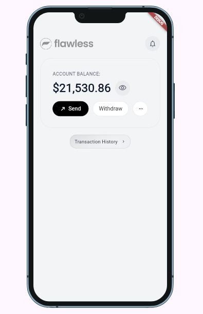
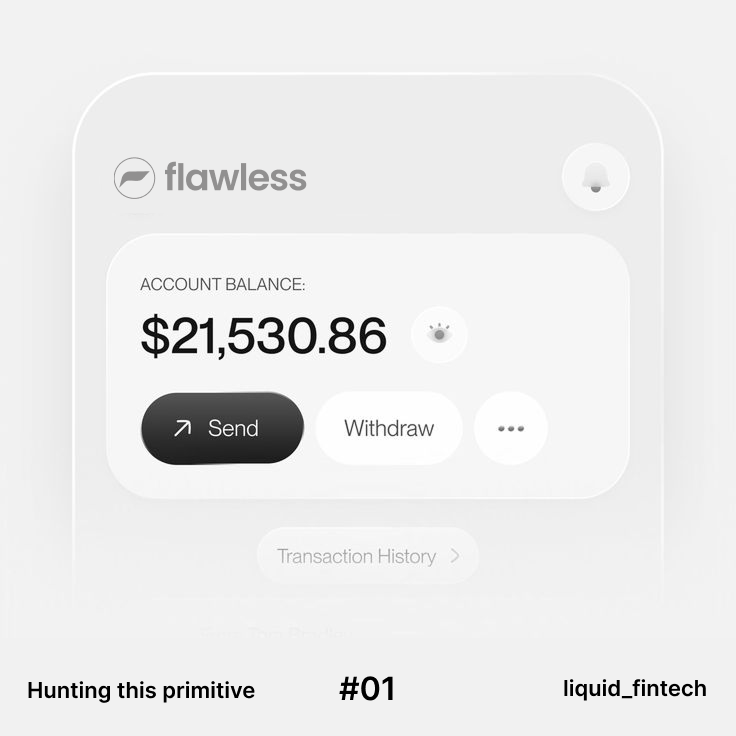

# 🥛 Lab Challenge: The "Milky Glass" Diffusion

> **Building the Glass Contract Together**  
> *Where precision engineering meets visual poetry.*

## Status: Experimental (Alpha.7) 🧪

**Lead Architect:** James Kamwendo  
**Challenge Duration:** Ongoing until Alpha.8 Release  
**Difficulty:** Intermediate (Architecture-Aware)

---

## 🎯 The Vision

With the release of Alpha.7, we have crystallized the **Glass Contract**—the architectural logic that allows components to resolve styles dynamically through property maps. The system is **headless by design**: it separates *what* (your intent) from *how* (the rendering logic).

But here's the truth: **the visual "soul" of glassmorphism remains unclaimed.**

That specific, frosted, milky diffusion you see in world-class fintech apps—that feeling of "liquid light" catching on a surface—**that's the prize.** And we need your eyes, your experiments, and your PRs to capture it.

### The Objective

Refine the `GlassCard` and `GlassButton` implementations to achieve the **Target Aesthetic** while strictly honoring the **Flawless Design System** architecture. This isn't about hacks. It's about *discovering the right tokens* and *composing them beautifully.*

---

## 📸 Visual Brief

| Current Alpha.7 Build | Target Aesthetic (The Goal) |
| :--- | :--- |
|  |  |

### What's Missing from the Current Build

| Aspect | Current State | Target Goal |
|--------|---------------|-------------|
| **Light Catching** | Dark borders derived from `onSurface` | Subtle white-on-white border highlights (10-20% opacity) |
| **Milkiness** | Blur-only; feels transparent/watery | White-tinted diffusion that feels "thick" and substantial |
| **Depth** | Flat shadow; slightly "dirty" appearance | Crisp, layered, liquid feel with soft, diffuse elevation |
| **Border Philosophy** | Borders inherit from color scheme | Borders are *light effects*, not structural outlines |

---

## 🏛 The Glass Contract: Our Shared Architecture

Before you dive into pixels, understand the **Contract** we're all bound by. This ensures your work isn't just beautiful—it's *mergeable*.

### The Three Pillars

```
┌─────────────────────────────────────────────────────────────┐
│  PILLAR 1: TOKEN-DRIVEN                                     │
│  No hardcoded Colors.white in widget code                   │
│  Source everything from component property maps             │
└─────────────────────────────────────────────────────────────┘
                              ↓
┌─────────────────────────────────────────────────────────────┐
│  PILLAR 2: HEADLESS COMPONENTS                                │
│  Design System provides intent → Component renders output   │
│  Same card widget, different visual system                  │
└─────────────────────────────────────────────────────────────┘
                              ↓
┌─────────────────────────────────────────────────────────────┐
│  PILLAR 3: VARIANT-AWARE RENDERING                          │
│  primary, surface, outline, ghost — each has unique         │
│  fill opacity, border opacity, shadow weight                │
└─────────────────────────────────────────────────────────────┘
```

### How the Flow Works

```
┌────────────────┐     ┌──────────────────┐     ┌─────────────────┐
│  Design System │────▶│ Component Props  │────▶│  Widget Render  │
│   (Tokens)     │     │   (Property Map)   │     │  (BackdropFilter│
│                │     │                  │     │   + BoxDecoration│
└────────────────┘     └──────────────────┘     └─────────────────┘
```

**The magic happens in the middle:** The component property map is your canvas. The widget just reads and renders.

---

## 🗂 Where the Code Lives

Understanding the codebase shouldn't be a treasure hunt. Here's your map:

### 🎨 Design Tokens (The "What")

| File | Responsibility |
|------|--------------|
| `packages/flawless_glass_theme/lib/glass_design_system.dart` | **GlassCardComponentProperties** — defines all card tokens: `tintColor`, `borderColor`, `highlightColor`, `glassOpacity`, `glassBlurSigma`, etc. |
| `packages/flawless_glass_theme/lib/glass_design_system.dart` | **GlassButtonComponentProperties** — defines button tokens: `variantFillOpacity`, `variantBorderOpacity`, `variantShadowOpacity`, `colors` per variant |

### 🧩 Component Implementation (The "How")

| File | Responsibility |
|------|--------------|
| `packages/flawless_glass_components/lib/src/glass_card.dart` | Reads tokens via `FlawlessComponentPropertiesReader`, applies to `BackdropFilter` + layered `BoxDecoration` |
| `packages/flawless_glass_components/lib/src/glass_button.dart` | Variant-aware rendering; applies per-variant opacity maps |
| `packages/flawless_ui/lib/src/flawless_card.dart` | Facade that routes to `GlassCard` or `Material3Card` based on active Design System |
| `packages/flawless_ui/lib/src/flawless_button.dart` | Facade that routes to `GlassButton` or `Material3Button` |

### 🧪 Your Testing Ground

| File | Responsibility |
|------|--------------|
| `examples/showcase_apps/cards/liquid_fintech/lib/flawless_cow_screen.dart` | **The C.O.W. Screen** — showcase for card and button variants |
| `examples/showcase_apps/cards/liquid_fintech/target_reference.png` | The target aesthetic to match |
| `examples/showcase_apps/cards/liquid_fintech/lib/flawless_bootstrap.dart` | Theme configuration — switch between Glass and Material3 |

---

## 🔬 Current Token State (Alpha.7)

Here's what's already in place. Your job: **tune these values** or **add new tokens** if the Contract needs extension.

### GlassCard Tokens (Current Defaults)

```dart
// packages/flawless_glass_theme/lib/glass_design_system.dart
Map<String, dynamic> get properties => {
  'borderRadius': 34.0,           // Soft, generous rounding
  'borderWidth': 1.0,             // Thin, elegant borders
  'glassBlurSigma': 15.0,         // BackdropFilter blur strength
  'glassOpacity': 0.18,           // Base tint opacity (fallback)
  'tintColor': '#FFFFFF',         // The "milky" white
  'borderColor': '#FFFFFF',       // Light-catching border
  'borderOpacity': 0.34,          // Border visibility
  'highlightColor': '#FFFFFF',    // Top-edge light reflection
  'highlightOpacity': 0.08,       // Subtle sheen
  'shadowOpacity': 0.04,          // Soft elevation
  'padding': { /* ... */ },
};
```

### GlassButton Tokens (Current Defaults)

```dart
// Variant-aware opacity maps (per-button-type tuning)
'variantFillOpacity': {
  'primary': 0.075,
  'secondary': 0.065,
  'surface': 0.06,        // Milky white button
  'outline': 0.0,         // Transparent
  'ghost': 0.0,           // Transparent
  'destructive': 0.075,
  'inverse': 0.075,
},
'variantBorderOpacity': {
  'primary': 0.06,
  'secondary': 0.10,
  'surface': 0.10,
  'outline': 0.20,        // Stronger border (it's all it has)
  'ghost': 0.0,
  'destructive': 0.14,
  'inverse': 0.08,
},
'variantShadowOpacity': {
  'primary': 0.05,
  'secondary': 0.05,
  'surface': 0.04,
  'outline': 0.0,         // No shadow (border-only)
  'ghost': 0.0,           // No shadow
  'destructive': 0.05,
  'inverse': 0.05,
},
```

---

## 🎨 The Art of Milky Glass

Achieving the target isn't about one value—it's about **composition**. Here's what the visual experts tell us:

### The Layer Stack (Bottom to Top)

```
┌─────────────────────────────────────┐
│  Layer 4: Top Highlight Border        │  ← Light catching (white, 8-22% opacity)
│  (Border.all, white, thin)            │
├─────────────────────────────────────┤
│  Layer 3: Content (Text/Icons)        │
├─────────────────────────────────────┤
│  Layer 2: Structural Border           │  ← Defines the shape (white, 14-34% opacity)
│  (Border.all, white, 1.0 width)       │
├─────────────────────────────────────┤
│  Layer 1: Milkiness (Gradient Fill)   │  ← The frosted tint
│  (LinearGradient, white tint,         │     Top: opacity × 1.15
│   top-left to bottom-right)           │     Bottom: opacity × 0.70
├─────────────────────────────────────┤
│  Layer 0: BackdropFilter (Blur)       │  ← The blur that makes it "glass"
│  (ImageFilter.blur, sigma: 15-20)     │
└─────────────────────────────────────┘
```

### Tuning Philosophy

| If it looks... | Try adjusting... |
|----------------|------------------|
| Too transparent/watery | ↑ `glassOpacity` or `variantFillOpacity` |
| Too flat | ↑ `shadowOpacity` (subtle!) or `borderOpacity` |
| Borders too dark | Ensure `borderColor` is `'#FFFFFF'`, not derived from `onSurface` |
| Not "milky" enough | ↑ `tintColor` saturation toward white, check gradient alpha math |
| Too harsh/artificial | ↓ `highlightOpacity`, soften `borderOpacity` |

---

## 🚀 How to Contribute

We're building this Contract **together**. Your PRs aren't just code—they're contributions to a shared language for Flutter glassmorphism.

### Step 1: Set Up Your Lab

```bash
# Navigate to the testing ground
cd examples/showcase_apps/cards/liquid_fintech

# Run the C.O.W. screen
flutter run

# Switch to Glass theme in the app to see your changes
```

### Step 2: Experiment

**Option A: Tune Existing Tokens**
- Edit `packages/flawless_glass_theme/lib/glass_design_system.dart`
- Adjust `GlassCardComponentProperties` values
- Hot reload and observe

**Option B: Extend the Contract**
- Need a new token (e.g., `gradientStartOpacity`, `innerShadow`)?
- Add it to the property map in `GlassCardComponentProperties`
- Consume it in `packages/flawless_glass_components/lib/src/glass_card.dart`
- Document it in your PR

### Step 3: Validate Against Architecture

Before submitting, verify:

- [ ] **No hardcoded colors** in widget files (use `props.value('tintColor')`)
- [ ] **Tokens have defaults** in `GlassCardComponentProperties`
- [ ] **Backwards compatible** — existing apps don't break
- [ ] **Performance tested** — `BackdropFilter` isn't over-used
- [ ] **Screenshot included** — show your result vs. target

### Step 4: Submit Your Vision

```bash
git checkout -b feat/milky-glass-[your-github-handle]
git add .
git commit -m "feat(glass): [brief description of milky improvement]"
git push origin feat/milky-glass-[your-github-handle]
```

Open a PR with the tag **`[LAB-CHALLENGE]`** in the title.

---

## 🏆 Recognition

The contributor(s) whose solution best captures the **"Milky Goal"** will:

- ✅ Have their logic **merged into `flawless_core`** for Alpha.8
- ✅ Be **credited in the release notes** as a Contract Architect
- ✅ Receive the **Glass Badge** in our community Discord
- ✅ Shape the **visual language** thousands of Flutter devs will use

---

## 💬 Questions? Stuck?

The Contract is a living document. If the architecture needs to evolve to achieve the vision, **we evolve it together.**

- Open a [Discussion](https://github.com/your-org/flawless/discussions) with `[GLASS-LAB]`
- Tag `@james-kamwendo` for architectural questions
- Share screenshots early and often—visual work thrives on feedback

---

## 🥛 Let's Build the Future of Flutter UI

The best design systems aren't built by one person. They're **co-authored** by developers who care about craft, by designers who respect engineering, and by communities who believe that open-source can be beautiful **and** rigorous.

**This is the Glass Contract.**  
**And we're building it together.**

---

*Last Updated: April 2026 | Alpha.7 | Contract Version 0.1*
